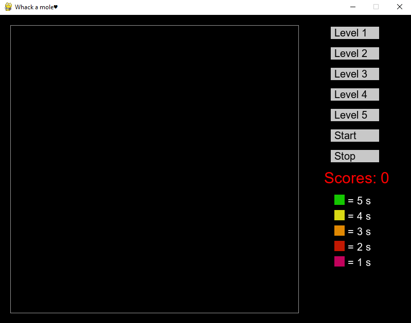
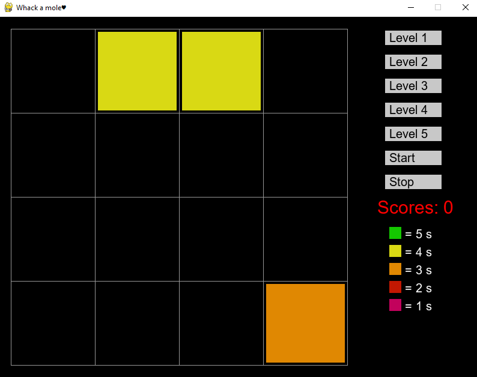
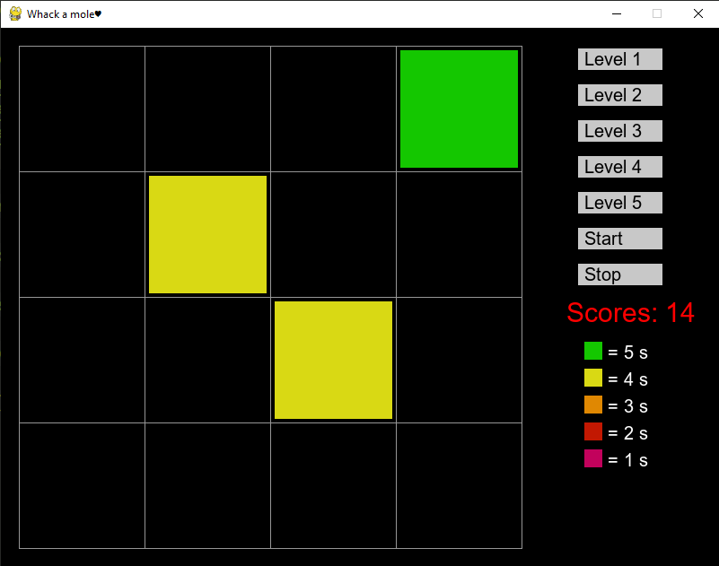
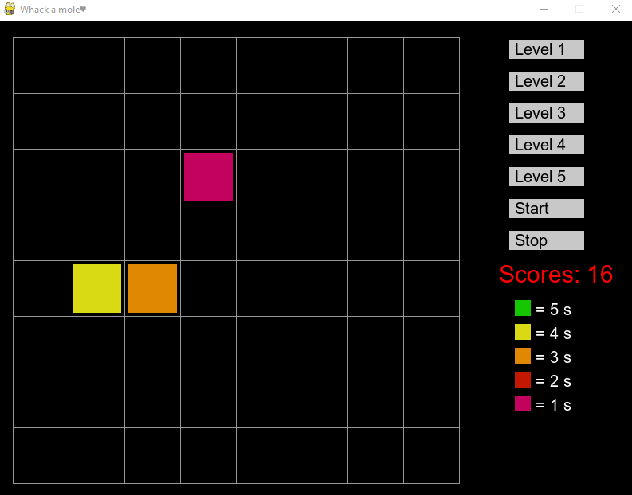

# Whack a mole

You can selecte different level, wich means a bigger or smaller grid. Different colors means different lengths of time that cell remains on the screen. If you click on a cell in time you gain 1 point, otherwise you lose 1 point.

